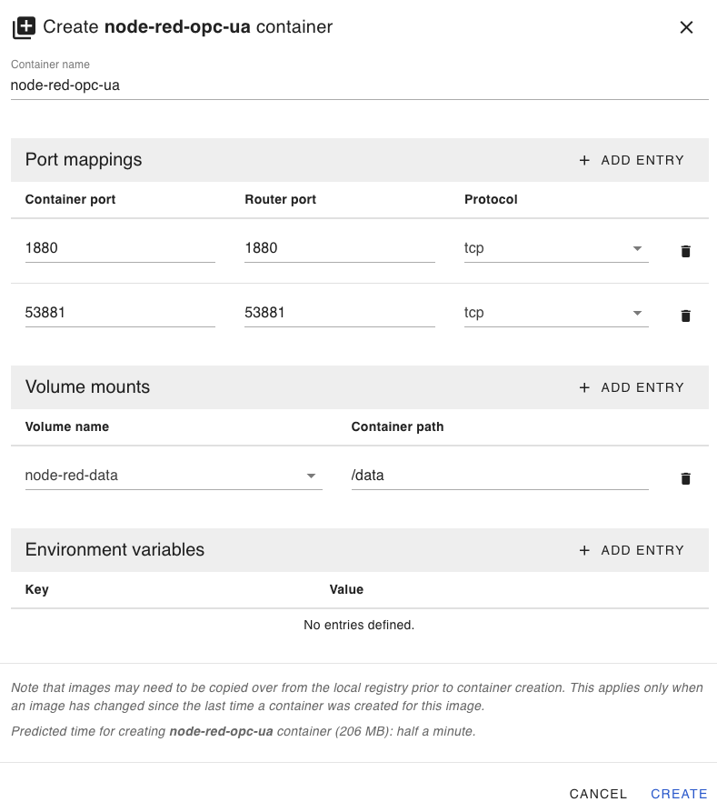
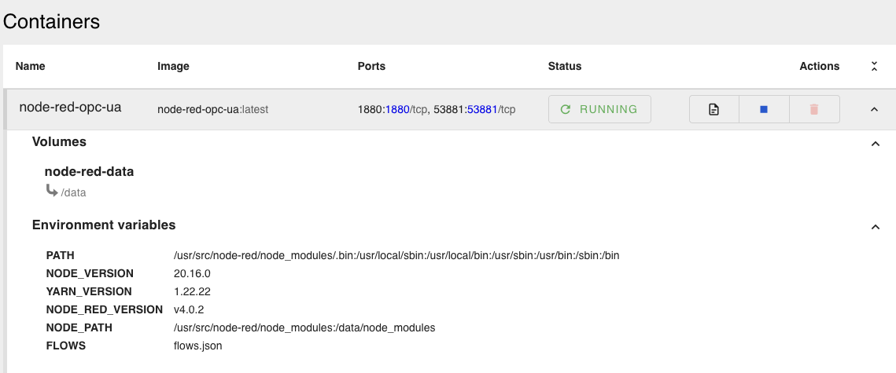
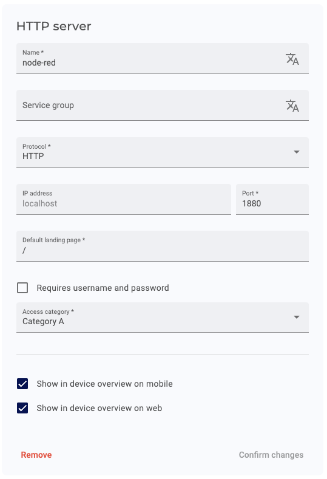
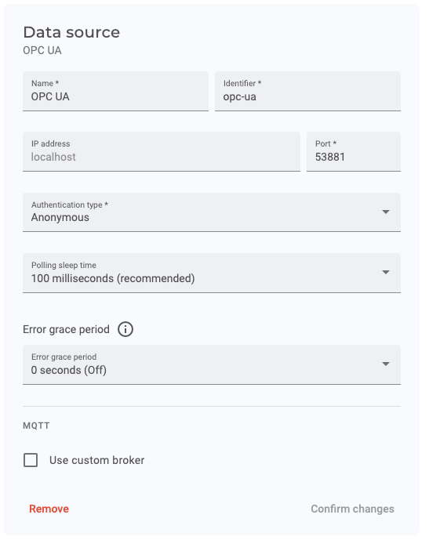
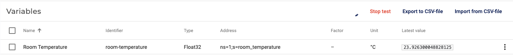

# Edge App - Node-RED with OPC UA Server writing data to IXON Cloud

## Prerequisites

Ensure your environment is properly set up by following this guide: [Running custom Docker applications on the SecureEdge Pro](https://support.ixon.cloud/hc/en-us/articles/14231117531420-Running-custom-Docker-applications-on-the-SecureEdge-Pro).

## Steps to Deploy Node-RED with OPC UA Nodes

### 1. Build and Push the Node-RED Container

Run the `build_and_push_containers.sh` script to build and push the Node-RED container with OPC-UA nodes to the SecureEdge Pro:

```bash
./build_and_push_containers.sh
```

### 2. Set Up the Container on SecureEdge Pro

- Access the local web interface of the SecureEdge Pro.
- Create a `node-red-opc-ua` container using the `node-red-opc-ua` image with the following port mappings:

  ```
  Port Mapping: 1880:1880
  Port Mapping: 53881:53881
  ```

- Create a volume with the following settings:

  ```
  Volume: node-red-data -> /data
  ```

Refer to the screenshot for configuration details:  


### 3. Start the Container

- Wait for the container to be created.
- Start the container.

Refer to the screenshot for details:  


### 4. Access Node-RED Web Interface

- In IXON Cloud, create an HTTP Web Server to easily access the Node-RED web interface on the SecureEdge Pro.

Refer to the screenshot for configuration details:  


- You can now access the Node-RED web interface on the SecureEdge Pro via the HTTP Web Server you created in IXON Cloud.

### 5. Start the Server in Node-RED

In the Node-RED interface:

1. Click **Add room_temperature Variable** to create the variable in the OPC UA server.
2. Click **Update room_temperature every 10s** to start a loop that updates the variable every 10 seconds.

### 6. Set Up OPC UA Data Source in IXON Cloud

- In IXON Cloud, create an OPC UA datasource to access the OPC UA server running in Node-RED on the SecureEdge Pro.
- Import the variables using the provided CSV file: `ixon_cloud_settings/variables.csv`.
- Run the test to ensure the connection is working.

Refer to the screenshots for configuration and testing details:  
  


### 7. You can now access the data from the OPC UA server in IXON Cloud.
