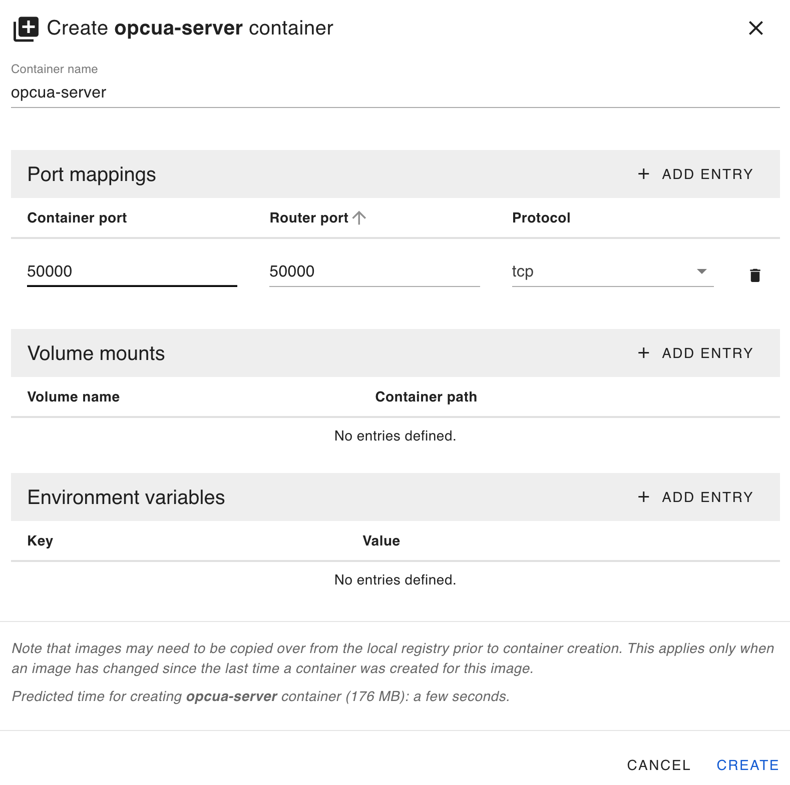
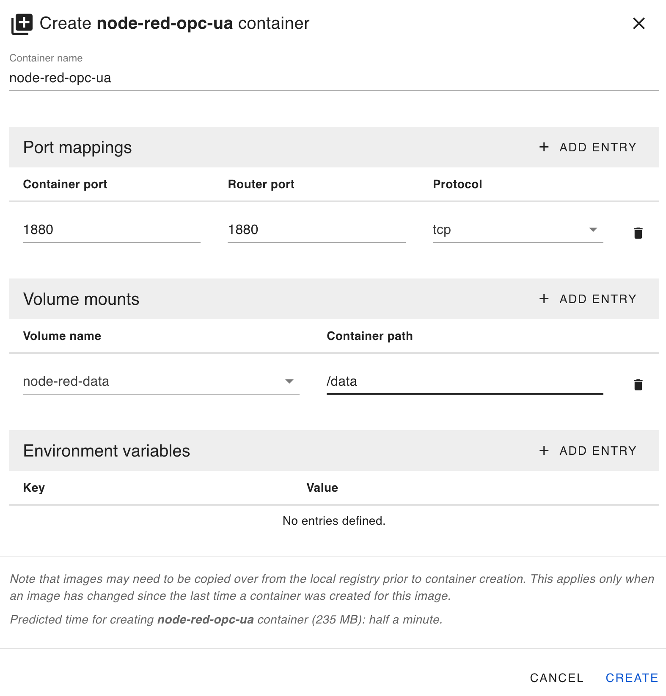
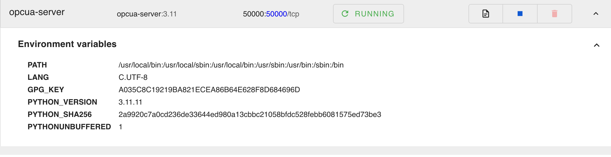
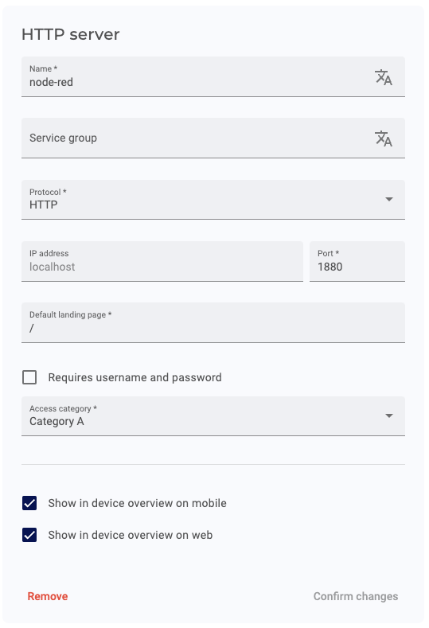
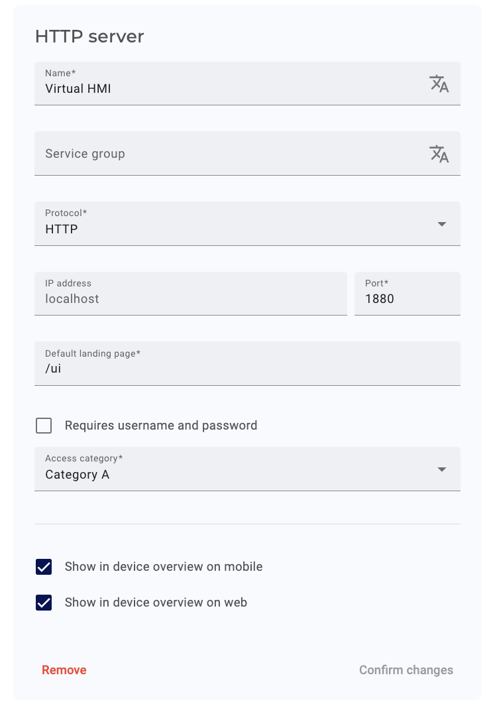
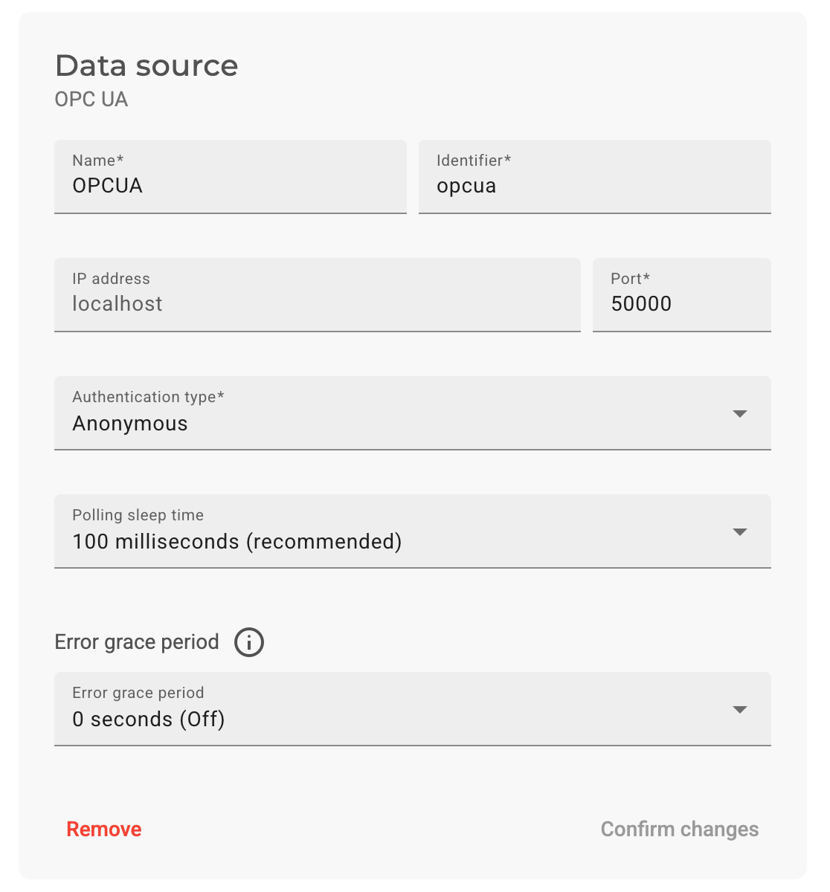
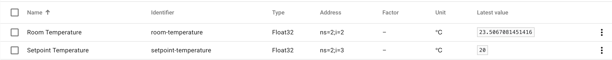

# Edge App - Node-RED with OPC UA Server writing data to IXON Cloud

This project demonstrates the integration of Node-RED with an OPC UA Server, specifically designed for deployment on IXON's SecureEdge Pro device and seamless integration with IXON Cloud. It showcases how to leverage IXON's industrial IoT ecosystem for efficient edge computing and cloud connectivity.

Key components of this project include:

1. A custom Node-RED image with OPC UA nodes, optimized for SecureEdge Pro
2. An OPC UA Server built with python
3. Docker-based deployment tailored for SecureEdge Pro
4. Direct integration with IXON Cloud for secure data storage and visualization

[!IMPORTANT]  
Originally, the OPC UA Server node was hosted within the Node-RED container. However, due to [an issue causing Node-RED to become unresponsive](https://github.com/mikakaraila/node-red-contrib-opcua/issues/770) when adding the server node to new flows, the solution has now been split into **two Docker containers**:

This solution demonstrates the power of IXON's SecureEdge Pro as an edge computing platform, capable of running containerized applications like Node-RED. It also highlights the seamless connectivity between edge devices and IXON Cloud, enabling remote monitoring, data analysis, and device management through a unified platform.

Users can take this project as a template and adapt it for their specific use cases within the IXON ecosystem. The flexibility of Node-RED combined with the robustness of SecureEdge Pro allows for easy customization of data flows and integration with various industrial protocols. Whether you need to collect data from PLCs, implement custom data processing logic, or create tailored dashboards in IXON Cloud, this project provides a solid foundation that can be extended to meet diverse requirements in various industrial IoT scenarios.

## Steps to Deploy Node-RED with OPC UA Nodes

### Prerequisites

Ensure your environment is properly set up by following this guide: [Running custom Docker applications on the SecureEdge Pro](https://support.ixon.cloud/hc/en-us/articles/14231117531420-Running-custom-Docker-applications-on-the-SecureEdge-Pro).

### 1. Download and adjust to your SecureEdge Pro

Download the code of this project and change the IP address in the following files to the LAN IP address of your SecureEge Pro:

- buildkitd-secure-edge-pro.toml
- build_and_push_containers.sh
- build_and_push_containers.cmd

### 2. Build and Push the Node-RED Container

Ensure you have the correct builder in use:

For Unix-based systems:

```bash
./setup-buildx-env.sh
```

For Windows:

```cmd
setup-buildx-env.cmd
```

Run the script to build and push the Node-RED container with OPC-UA nodes to the SecureEdge Pro:

For Unix-based systems:

```bash
./build_and_push_containers.sh
```

For Windows:

```cmd
build_and_push_containers.cmd
```

### 3. Set Up the OPC UA Server on SecureEdge Pro

- Access the local web interface of the SecureEdge Pro.
- Create a `opcua-server` container using the `opcua-server` image with the following port mappings:

  ```
  Port Mapping: 50000:50000
  ```

Refer to the screenshot for configuration details:  


### 4. Set Up the Container on SecureEdge Pro

- Access the local web interface of the SecureEdge Pro.
- Create a `node-red-opc-ua` container using the `node-red-opc-ua` image with the following port mappings:

  ```
  Port Mapping: 1880:1880
  ```

- Create a volume with the following settings:

  ```
  Volume: node-red-data -> /data
  ```

Refer to the screenshot for configuration details:  


### 5. Start the Containers

- Wait for the containers to be created.
- Start the containers.

Refer to the screenshots for details:  



### 6. Access Node-RED Web Interface

- In IXON Cloud, create an HTTP Web Server to easily access the Node-RED web interface on the SecureEdge Pro.

Refer to the screenshot for configuration details:  


- You can now access the Node-RED web interface on the SecureEdge Pro via the HTTP Web Server you created in IXON Cloud.
- The flow in Node-RED is already configured to write to the OPC UA server. It waits for the server to be ready to inject the variables and then starts the loop to update the variable.

### 7. Access Virtual HMI Web Interface

- In IXON Cloud, create an HTTP Web Server to easily access the Virtual HMI web interface on the SecureEdge Pro.

Refer to the screenshot for configuration details:  


- You can now access the Virtual HMI web interface on the SecureEdge Pro via the HTTP Web Server you created in IXON Cloud.

### 8. Set Up OPC UA Data Source in IXON Cloud

- In IXON Cloud, create an OPC UA datasource to access the OPC UA server running in Node-RED on the SecureEdge Pro.
- Import the variables using the provided CSV file: `opcua-server/ixon_cloud_settings/variables.csv`.
- Run the test to ensure the connection is working.

Refer to the screenshots for configuration and testing details:  
  


### 9. You can now access the data from the OPC UA server in IXON Cloud.
